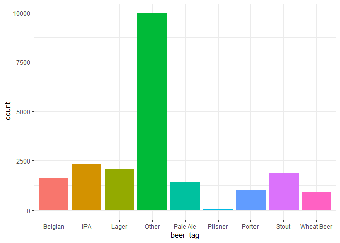

BeerAdvocate Data Exploration and Cleaning
==========================================

For CS 5890 Final Project

Exploration
===========

Import Data
-----------

In this exploration we will be using `ggplot2`, `dplyr`, and
`data.table` to read in the data.

    t1 <- fread("data/beer_reviews-1.csv")
    t2 <- fread("data/beer_reviews-2.csv")
    t3 <- fread("data/beer_reviews-3.csv")
    t4 <- fread("data/beer_reviews-4.csv")
      
    ba_raw <- rbind(t1, t2, t3, t4) %>% as_tibble() %>% select(-V1)# import the data as a dplyr tibble
    rm(t1, t2, t3, t4)
    colnames(ba_raw) # the variables:

    ##  [1] "brewery_id"         "brewery_name"       "review_time"       
    ##  [4] "review_overall"     "review_aroma"       "review_appearance" 
    ##  [7] "review_profilename" "beer_style"         "review_palate"     
    ## [10] "review_taste"       "beer_name"          "beer_abv"          
    ## [13] "beer_beerid"

Let's get rid of some of those extra variables that we don't care about

    ba <- select(ba_raw, -c(review_profilename))
    knitr::kable(head(ba))

<table>
<thead>
<tr class="header">
<th align="right">brewery_id</th>
<th align="left">brewery_name</th>
<th align="right">review_time</th>
<th align="right">review_overall</th>
<th align="right">review_aroma</th>
<th align="right">review_appearance</th>
<th align="left">beer_style</th>
<th align="right">review_palate</th>
<th align="right">review_taste</th>
<th align="left">beer_name</th>
<th align="right">beer_abv</th>
<th align="right">beer_beerid</th>
</tr>
</thead>
<tbody>
<tr class="odd">
<td align="right">10325</td>
<td align="left">Vecchio Birraio</td>
<td align="right">1234817823</td>
<td align="right">1.5</td>
<td align="right">2.0</td>
<td align="right">2.5</td>
<td align="left">Hefeweizen</td>
<td align="right">1.5</td>
<td align="right">1.5</td>
<td align="left">Sausa Weizen</td>
<td align="right">5.0</td>
<td align="right">47986</td>
</tr>
<tr class="even">
<td align="right">10325</td>
<td align="left">Vecchio Birraio</td>
<td align="right">1235915097</td>
<td align="right">3.0</td>
<td align="right">2.5</td>
<td align="right">3.0</td>
<td align="left">English Strong Ale</td>
<td align="right">3.0</td>
<td align="right">3.0</td>
<td align="left">Red Moon</td>
<td align="right">6.2</td>
<td align="right">48213</td>
</tr>
<tr class="odd">
<td align="right">10325</td>
<td align="left">Vecchio Birraio</td>
<td align="right">1235916604</td>
<td align="right">3.0</td>
<td align="right">2.5</td>
<td align="right">3.0</td>
<td align="left">Foreign / Export Stout</td>
<td align="right">3.0</td>
<td align="right">3.0</td>
<td align="left">Black Horse Black Beer</td>
<td align="right">6.5</td>
<td align="right">48215</td>
</tr>
<tr class="even">
<td align="right">10325</td>
<td align="left">Vecchio Birraio</td>
<td align="right">1234725145</td>
<td align="right">3.0</td>
<td align="right">3.0</td>
<td align="right">3.5</td>
<td align="left">German Pilsener</td>
<td align="right">2.5</td>
<td align="right">3.0</td>
<td align="left">Sausa Pils</td>
<td align="right">5.0</td>
<td align="right">47969</td>
</tr>
<tr class="odd">
<td align="right">1075</td>
<td align="left">Caldera Brewing Company</td>
<td align="right">1293735206</td>
<td align="right">4.0</td>
<td align="right">4.5</td>
<td align="right">4.0</td>
<td align="left">American Double / Imperial IPA</td>
<td align="right">4.0</td>
<td align="right">4.5</td>
<td align="left">Cauldron DIPA</td>
<td align="right">7.7</td>
<td align="right">64883</td>
</tr>
<tr class="even">
<td align="right">1075</td>
<td align="left">Caldera Brewing Company</td>
<td align="right">1325524659</td>
<td align="right">3.0</td>
<td align="right">3.5</td>
<td align="right">3.5</td>
<td align="left">Herbed / Spiced Beer</td>
<td align="right">3.0</td>
<td align="right">3.5</td>
<td align="left">Caldera Ginger Beer</td>
<td align="right">4.7</td>
<td align="right">52159</td>
</tr>
</tbody>
</table>

These data represent 1586616 different reviews of 56858 beers from 5744
different breweries.

Plots
-----

    p1 <- ggplot(ba) +
      stat_bin(aes(x = review_overall), binwidth = 0.25, fill = "#d1730c")
    p1

    brew <- unique(ba$brewery_name)

    beer <- unique(ba$beer_name)

    style <- unique(ba$beer_style)

    overTime <- tibble(time = c(8, 9, 10, 11, 12,
                                8, 9, 10, 11, 12,
                                8, 9, 10, 11, 12,
                                8, 9, 10, 11, 12,
                                8, 9, 10, 11, 12,
                                8, 9, 10, 11, 12), 
                       ave_rating = c(3.9, 3.8, 3.6, 4.7, 3.4, 
                                      4.0, 3.7, 3.5, 3.6, 3.3, 
                                      4.0, 3.7, 3.5, 3.6, 3.3,
                                      3.5, 3.6, 3.4, 3.5, 3.5, 
                                      3.8, 3.9, 3.8, 3.7, 4.0, 
                                      3.8, 3.9, 3.8, 3.7, 4.0),
                       person = c(1,1,1,1,1,
                                  2,2,2,2,2,
                                  3,3,3,3,3,
                                  4,4,4,4,4,
                                  5,5,5,5,5,
                                  6,6,6,6,6),
                       abv = c('high','high','high','high','high',
                               'high','high','high','high','high',
                               'high','high','high','high','high',
                               'low','low','low','low','low',
                               'low','low','low','low','low',
                               'low','low','low','low','low'))

    time_plot <- ggplot(overTime, aes(x = time, y = ave_rating, color = abv)) + 
      geom_smooth() + labs(title = "Average Rating over a night") + theme_bw()
    time_plot

    ## `geom_smooth()` using method = 'loess' and formula 'y ~ x'

    ggsave("process_img/time_vis.jpg", time_plot, width = 6, height = 4, units = 'in')

    ## `geom_smooth()` using method = 'loess' and formula 'y ~ x'

 

Data Cleaning and Grouping
==========================

By Beer Grouping
----------------

    by_beer <- ba %>%
      group_by(beer_name) %>%
      summarize(beer_id = beer_beerid[1],
                brewery_name = brewery_name[1],
                brewery_id = brewery_id[1],
                beer_style = beer_style[1],
                beer_abv = beer_abv[1],
                mean_overall = mean(review_overall),
                mean_aroma = mean(review_aroma),
                mean_appearance = mean(review_appearance),
                mean_palate = mean(review_palate),
                mean_taste = mean(review_taste),
                n_reviews = length(beer_name))%>%
      filter(n_reviews >= 5)

    included_beers <- by_beer$beer_name

    ba <- ba %>% filter(beer_name %in% included_beers)

    knitr::kable(filter(by_beer, brewery_name == "Uinta Brewing Company") %>% head(.,5))

<table>
<thead>
<tr class="header">
<th align="left">beer_name</th>
<th align="right">beer_id</th>
<th align="left">brewery_name</th>
<th align="right">brewery_id</th>
<th align="left">beer_style</th>
<th align="right">beer_abv</th>
<th align="right">mean_overall</th>
<th align="right">mean_aroma</th>
<th align="right">mean_appearance</th>
<th align="right">mean_palate</th>
<th align="right">mean_taste</th>
<th align="right">n_reviews</th>
</tr>
</thead>
<tbody>
<tr class="odd">
<td align="left">Angler's Pale Ale</td>
<td align="right">10573</td>
<td align="left">Uinta Brewing Company</td>
<td align="right">1416</td>
<td align="left">American Pale Ale (APA)</td>
<td align="right">5.8</td>
<td align="right">3.748000</td>
<td align="right">3.532000</td>
<td align="right">3.740000</td>
<td align="right">3.492000</td>
<td align="right">3.576000</td>
<td align="right">125</td>
</tr>
<tr class="even">
<td align="left">Anniversary Barley Wine</td>
<td align="right">3840</td>
<td align="left">Uinta Brewing Company</td>
<td align="right">1416</td>
<td align="left">American Barleywine</td>
<td align="right">10.4</td>
<td align="right">3.769366</td>
<td align="right">3.892606</td>
<td align="right">3.924296</td>
<td align="right">3.779930</td>
<td align="right">3.818662</td>
<td align="right">284</td>
</tr>
<tr class="odd">
<td align="left">Baba Black Lager</td>
<td align="right">73965</td>
<td align="left">Uinta Brewing Company</td>
<td align="right">1416</td>
<td align="left">Euro Dark Lager</td>
<td align="right">4.0</td>
<td align="right">3.566667</td>
<td align="right">3.500000</td>
<td align="right">3.900000</td>
<td align="right">3.733333</td>
<td align="right">3.500000</td>
<td align="right">15</td>
</tr>
<tr class="even">
<td align="left">Blue Sky Pilsner</td>
<td align="right">20281</td>
<td align="left">Uinta Brewing Company</td>
<td align="right">1416</td>
<td align="left">Czech Pilsener</td>
<td align="right">4.0</td>
<td align="right">3.596154</td>
<td align="right">3.384615</td>
<td align="right">3.557692</td>
<td align="right">3.423077</td>
<td align="right">3.326923</td>
<td align="right">26</td>
</tr>
<tr class="odd">
<td align="left">Bristlecone Brown</td>
<td align="right">14190</td>
<td align="left">Uinta Brewing Company</td>
<td align="right">1416</td>
<td align="left">English Brown Ale</td>
<td align="right">4.0</td>
<td align="right">3.576923</td>
<td align="right">3.307692</td>
<td align="right">3.807692</td>
<td align="right">3.384615</td>
<td align="right">3.346154</td>
<td align="right">13</td>
</tr>
</tbody>
</table>

    pickTag <- function(x){
      check = c("IPA", "Belgian", "Dubbel", "Tripel", "Stout", "Porter", "Pale Ale", "Lager", "Pilsner", "Hefeweizen", "Wheat")
      to =    c("IPA", "Belgian", "Belgian", "Belgian", "Stout", "Porter", "Pale Ale", "Lager", "Pilsner", "Wheat Beer", "Wheat Beer")
      
      # tag_maps <- tibble(check = c("IPA", "Belgian", "Dubbel", "Tripel", "Stout", "Porter", "Pale Ale", "Lager", "Pilsner", "Hefeweizen", "Wheat"),
      #                    to =    c("IPA", "Belgian", "Belgian", "Belgian", "Stout", "Porter", "Pale Ale", "Lager", "Pilsner", "Wheat Beer", "Wheat Beer"))
      
      for(i in 1:length(check)){
          if(grepl(check[i], x)){
            return(to[i])
          }
      }
      return("Other")
    }

    makeTags <- function(style){
      
      tags <- character(length(style))
        
      for(i in 1:length(style)){
        tags[i] = pickTag(style[i])
      }
      
      return(tags)
    }

    by_beer <- mutate(by_beer, beer_tag = makeTags(beer_style))

    ggplot(by_beer) +
      stat_count(aes(x = beer_tag, fill = beer_tag)) +
      theme_bw() +
      theme(legend.position = "none") 

    write.csv(by_beer, "data/byBeer.csv")

After grouping reviews of the same beer, and removing beers with &lt;5
reviews, we are now down to 21184 observations and 13 variables.

By Brewery Grouping
-------------------

    by_brewery <- ba %>%
      group_by(brewery_name) %>%
      summarize(brewery_id = brewery_id[1],
                beers = jsonlite::toJSON(unique(beer_name)), 
                beers_id = jsonlite::toJSON(as.character(unique(beer_beerid))), 
                n_beers = length(unique(beer_name)),
                mean_overall = mean(review_overall),
                mean_aroma = mean(review_aroma),
                mean_appearance = mean(review_appearance),
                mean_palate = mean(review_palate),
                mean_taste = mean(review_taste),
                n_reviews = length(brewery_name)) %>%
      filter(n_beers >= 5)

    write.csv(by_brewery, "data/byBrewery-noLocations.csv")

    included_breweries <- by_brewery$brewery_id

    ba <- ba %>% filter(brewery_id %in% included_breweries)

    knitr::kable(sample_n(by_brewery, 5))

<table>
<thead>
<tr class="header">
<th align="left">brewery_name</th>
<th align="right">brewery_id</th>
<th align="left">beers</th>
<th align="left">beers_id</th>
<th align="right">n_beers</th>
<th align="right">mean_overall</th>
<th align="right">mean_aroma</th>
<th align="right">mean_appearance</th>
<th align="right">mean_palate</th>
<th align="right">mean_taste</th>
<th align="right">n_reviews</th>
</tr>
</thead>
<tbody>
<tr class="odd">
<td align="left">Upstream Brewing Company - Old Market</td>
<td align="right">1056</td>
<td align="left">[&quot;Dundee Export 90 Scotch Ale&quot;,&quot;Batch 1000&quot;,&quot;Firehouse ESB&quot;,&quot;Grand Cru&quot;,&quot;American Wheat&quot;,&quot;Schwarzbier&quot;,&quot;British IPA&quot;,&quot;Oak-Aged IPA&quot;,&quot;Belgian Tripel&quot;,&quot;Belgian Dubbel&quot;,&quot;Upstream Gueuze Lambic&quot;,&quot;India Pale Ale&quot;,&quot;Capitol Premium Pale Ale&quot;,&quot;Oak-Aged Tripel&quot;,&quot;Blackstone Stout&quot;,&quot;Blueberry Ale&quot;,&quot;Downtown Brown&quot;,&quot;Double IPA&quot;,&quot;Railyard Ale&quot;,&quot;Oak-Aged Ebenezer's Brew&quot;,&quot;Midnight Porter&quot;]</td>
<td align="left">[&quot;3176&quot;,&quot;33583&quot;,&quot;3174&quot;,&quot;37639&quot;,&quot;7466&quot;,&quot;58861&quot;,&quot;31111&quot;,&quot;41411&quot;,&quot;21361&quot;,&quot;26629&quot;,&quot;41021&quot;,&quot;3175&quot;,&quot;17915&quot;,&quot;40915&quot;,&quot;3177&quot;,&quot;25908&quot;,&quot;12876&quot;,&quot;17914&quot;,&quot;3173&quot;,&quot;34712&quot;,&quot;21511&quot;]</td>
<td align="right">21</td>
<td align="right">3.911950</td>
<td align="right">3.751572</td>
<td align="right">3.808176</td>
<td align="right">3.776730</td>
<td align="right">3.886792</td>
<td align="right">159</td>
</tr>
<tr class="even">
<td align="left">Kelly's Caribbean Bar, Grill &amp; Brewery</td>
<td align="right">1092</td>
<td align="left">[&quot;Key West Golden Ale&quot;,&quot;Winter Ale&quot;,&quot;Havana Red&quot;,&quot;Chocolate Porter&quot;,&quot;Kelly's Southern Clipper&quot;]</td>
<td align="left">[&quot;20018&quot;,&quot;28702&quot;,&quot;3560&quot;,&quot;3559&quot;,&quot;3259&quot;]</td>
<td align="right">5</td>
<td align="right">3.419355</td>
<td align="right">3.209677</td>
<td align="right">3.274193</td>
<td align="right">3.306452</td>
<td align="right">3.290323</td>
<td align="right">31</td>
</tr>
<tr class="odd">
<td align="left">Roots Organic Brewery</td>
<td align="right">10996</td>
<td align="left">[&quot;Belgian Wit&quot;,&quot;Toasted Coconut Porter&quot;,&quot;Calypso&quot;,&quot;EXXXcalibur Stout&quot;,&quot;Festivus&quot;,&quot;Woody Organic IPA&quot;,&quot;Island Red&quot;,&quot;Hoppopotamus&quot;,&quot;Epic Ale&quot;,&quot;Burghead Heather Ale&quot;]</td>
<td align="left">[&quot;25342&quot;,&quot;26086&quot;,&quot;44850&quot;,&quot;24408&quot;,&quot;35083&quot;,&quot;23227&quot;,&quot;25341&quot;,&quot;45301&quot;,&quot;27617&quot;,&quot;24203&quot;]</td>
<td align="right">10</td>
<td align="right">3.629870</td>
<td align="right">3.649351</td>
<td align="right">3.623377</td>
<td align="right">3.642857</td>
<td align="right">3.720779</td>
<td align="right">77</td>
</tr>
<tr class="even">
<td align="left">Pivovar Velké Popovice a.s.</td>
<td align="right">448</td>
<td align="left">[&quot;Kozel Cerny (Kozel Dark) Velckopopovicky&quot;,&quot;Kozel&quot;,&quot;Kozel Svétlý&quot;,&quot;Kozel Premium&quot;,&quot;Master Tmavy&quot;,&quot;Kozel 11° Medium&quot;]</td>
<td align="left">[&quot;16273&quot;,&quot;5430&quot;,&quot;18502&quot;,&quot;45385&quot;,&quot;39317&quot;,&quot;45384&quot;]</td>
<td align="right">6</td>
<td align="right">3.734211</td>
<td align="right">3.486842</td>
<td align="right">3.707895</td>
<td align="right">3.521053</td>
<td align="right">3.607895</td>
<td align="right">190</td>
</tr>
<tr class="odd">
<td align="left">Moorhouse's Brewery (Burnley) Ltd</td>
<td align="right">109</td>
<td align="left">[&quot;Black Cat&quot;,&quot;English Owd Ale&quot;,&quot;Pendle Witches Brew&quot;,&quot;Moorhouse Blond Witch&quot;,&quot;Bitter&quot;]</td>
<td align="left">[&quot;341&quot;,&quot;48499&quot;,&quot;340&quot;,&quot;13121&quot;,&quot;24456&quot;]</td>
<td align="right">5</td>
<td align="right">3.881323</td>
<td align="right">3.645914</td>
<td align="right">3.801556</td>
<td align="right">3.661479</td>
<td align="right">3.727626</td>
<td align="right">257</td>
</tr>
</tbody>
</table>

After grouping reviews from beers at the same brewery, and removing
breweries with &lt;5 beers, we are now down to 1638 observations and 11
variables.

CSV Split
---------

In this we will split the original `ba` dataset by brewery and write
each to a csv. This will allow for easier and faster loading on the
webpage.

    ba %>% group_by(brewery_name) %>%
      do(write.csv(., sprintf("data/breweries/%s.csv", .$brewery_id[1])))
