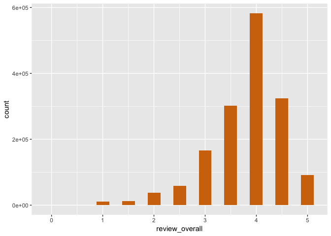
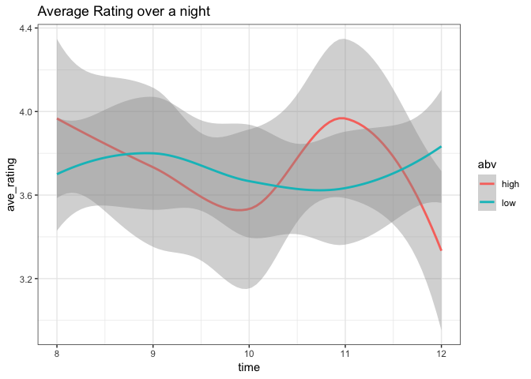

Import Data
-----------

In this exploration we will be using `ggplot2`, `dplyr`, and
`data.table` to read in the data.

    t1 <- fread("data/beer_reviews-1.csv")
    t2 <- fread("data/beer_reviews-2.csv")
    t3 <- fread("data/beer_reviews-3.csv")
    t4 <- fread("data/beer_reviews-4.csv")
      
    ba_raw <- rbind(t1, t2, t3, t4) %>% as_tibble() %>% select(-V1)# import the data as a dplyr tibble
    rm(t1, t2, t3, t4)
    colnames(ba_raw) # the variables:

    ##  [1] "brewery_id"         "brewery_name"       "review_time"       
    ##  [4] "review_overall"     "review_aroma"       "review_appearance" 
    ##  [7] "review_profilename" "beer_style"         "review_palate"     
    ## [10] "review_taste"       "beer_name"          "beer_abv"          
    ## [13] "beer_beerid"

Let's get rid of some of those extra variables that we don't care about

    ba <- select(ba_raw, -c(review_profilename))
    knitr::kable(head(ba))

<table>
<thead>
<tr class="header">
<th align="right">brewery_id</th>
<th align="left">brewery_name</th>
<th align="right">review_time</th>
<th align="right">review_overall</th>
<th align="right">review_aroma</th>
<th align="right">review_appearance</th>
<th align="left">beer_style</th>
<th align="right">review_palate</th>
<th align="right">review_taste</th>
<th align="left">beer_name</th>
<th align="right">beer_abv</th>
<th align="right">beer_beerid</th>
</tr>
</thead>
<tbody>
<tr class="odd">
<td align="right">10325</td>
<td align="left">Vecchio Birraio</td>
<td align="right">1234817823</td>
<td align="right">1.5</td>
<td align="right">2.0</td>
<td align="right">2.5</td>
<td align="left">Hefeweizen</td>
<td align="right">1.5</td>
<td align="right">1.5</td>
<td align="left">Sausa Weizen</td>
<td align="right">5.0</td>
<td align="right">47986</td>
</tr>
<tr class="even">
<td align="right">10325</td>
<td align="left">Vecchio Birraio</td>
<td align="right">1235915097</td>
<td align="right">3.0</td>
<td align="right">2.5</td>
<td align="right">3.0</td>
<td align="left">English Strong Ale</td>
<td align="right">3.0</td>
<td align="right">3.0</td>
<td align="left">Red Moon</td>
<td align="right">6.2</td>
<td align="right">48213</td>
</tr>
<tr class="odd">
<td align="right">10325</td>
<td align="left">Vecchio Birraio</td>
<td align="right">1235916604</td>
<td align="right">3.0</td>
<td align="right">2.5</td>
<td align="right">3.0</td>
<td align="left">Foreign / Export Stout</td>
<td align="right">3.0</td>
<td align="right">3.0</td>
<td align="left">Black Horse Black Beer</td>
<td align="right">6.5</td>
<td align="right">48215</td>
</tr>
<tr class="even">
<td align="right">10325</td>
<td align="left">Vecchio Birraio</td>
<td align="right">1234725145</td>
<td align="right">3.0</td>
<td align="right">3.0</td>
<td align="right">3.5</td>
<td align="left">German Pilsener</td>
<td align="right">2.5</td>
<td align="right">3.0</td>
<td align="left">Sausa Pils</td>
<td align="right">5.0</td>
<td align="right">47969</td>
</tr>
<tr class="odd">
<td align="right">1075</td>
<td align="left">Caldera Brewing Company</td>
<td align="right">1293735206</td>
<td align="right">4.0</td>
<td align="right">4.5</td>
<td align="right">4.0</td>
<td align="left">American Double / Imperial IPA</td>
<td align="right">4.0</td>
<td align="right">4.5</td>
<td align="left">Cauldron DIPA</td>
<td align="right">7.7</td>
<td align="right">64883</td>
</tr>
<tr class="even">
<td align="right">1075</td>
<td align="left">Caldera Brewing Company</td>
<td align="right">1325524659</td>
<td align="right">3.0</td>
<td align="right">3.5</td>
<td align="right">3.5</td>
<td align="left">Herbed / Spiced Beer</td>
<td align="right">3.0</td>
<td align="right">3.5</td>
<td align="left">Caldera Ginger Beer</td>
<td align="right">4.7</td>
<td align="right">52159</td>
</tr>
</tbody>
</table>

These data represent 1586616 different reviews of 56858 beers from 5744
different breweries.

Plots
-----

    p1 <- ggplot(ba) +
      stat_bin(aes(x = review_overall), binwidth = 0.25, fill = "#d1730c")
    p1

    brew <- unique(ba$brewery_name)

    beer <- unique(ba$beer_name)

    style <- unique(ba$beer_style)

    overTime <- tibble(time = c(8, 9, 10, 11, 12,
                                8, 9, 10, 11, 12,
                                8, 9, 10, 11, 12,
                                8, 9, 10, 11, 12,
                                8, 9, 10, 11, 12,
                                8, 9, 10, 11, 12), 
                       ave_rating = c(3.9, 3.8, 3.6, 4.7, 3.4, 
                                      4.0, 3.7, 3.5, 3.6, 3.3, 
                                      4.0, 3.7, 3.5, 3.6, 3.3,
                                      3.5, 3.6, 3.4, 3.5, 3.5, 
                                      3.8, 3.9, 3.8, 3.7, 4.0, 
                                      3.8, 3.9, 3.8, 3.7, 4.0),
                       person = c(1,1,1,1,1,
                                  2,2,2,2,2,
                                  3,3,3,3,3,
                                  4,4,4,4,4,
                                  5,5,5,5,5,
                                  6,6,6,6,6),
                       abv = c('high','high','high','high','high',
                               'high','high','high','high','high',
                               'high','high','high','high','high',
                               'low','low','low','low','low',
                               'low','low','low','low','low',
                               'low','low','low','low','low'))

    time_plot <- ggplot(overTime, aes(x = time, y = ave_rating, color = abv)) + 
      geom_smooth() + labs(title = "Average Rating over a night") + theme_bw()
    time_plot

    ## `geom_smooth()` using method = 'loess' and formula 'y ~ x'

    ggsave("process_img/time_vis.jpg", time_plot, width = 6, height = 4, units = 'in')

    ## `geom_smooth()` using method = 'loess' and formula 'y ~ x'

 

Data Cleaning and Grouping
--------------------------

    by_beer <- ba %>%
      group_by(beer_name) %>%
      summarize(beer_id = beer_beerid[1],
                brewery_name = brewery_name[1],
                brewery_id = brewery_id[1],
                beer_style = beer_style[1],
                beer_abv = beer_abv[1],
                mean_overall = mean(review_overall),
                mean_aroma = mean(review_aroma),
                mean_appearance = mean(review_appearance),
                mean_palate = mean(review_palate),
                mean_taste = mean(review_taste),
                n_reviews = length(beer_name))%>%
      filter(n_reviews >= 5)

    write.csv(by_beer, "data/byBeer.csv")

    knitr::kable(filter(by_beer, brewery_name == "Uinta Brewing Company") %>% head(.,10))

<table>
<thead>
<tr class="header">
<th align="left">beer_name</th>
<th align="right">beer_id</th>
<th align="left">brewery_name</th>
<th align="right">brewery_id</th>
<th align="left">beer_style</th>
<th align="right">beer_abv</th>
<th align="right">mean_overall</th>
<th align="right">mean_aroma</th>
<th align="right">mean_appearance</th>
<th align="right">mean_palate</th>
<th align="right">mean_taste</th>
<th align="right">n_reviews</th>
</tr>
</thead>
<tbody>
<tr class="odd">
<td align="left">Angler's Pale Ale</td>
<td align="right">10573</td>
<td align="left">Uinta Brewing Company</td>
<td align="right">1416</td>
<td align="left">American Pale Ale (APA)</td>
<td align="right">5.8</td>
<td align="right">3.748000</td>
<td align="right">3.532000</td>
<td align="right">3.740000</td>
<td align="right">3.492000</td>
<td align="right">3.576000</td>
<td align="right">125</td>
</tr>
<tr class="even">
<td align="left">Anniversary Barley Wine</td>
<td align="right">3840</td>
<td align="left">Uinta Brewing Company</td>
<td align="right">1416</td>
<td align="left">American Barleywine</td>
<td align="right">10.4</td>
<td align="right">3.769366</td>
<td align="right">3.892606</td>
<td align="right">3.924296</td>
<td align="right">3.779930</td>
<td align="right">3.818662</td>
<td align="right">284</td>
</tr>
<tr class="odd">
<td align="left">Baba Black Lager</td>
<td align="right">73965</td>
<td align="left">Uinta Brewing Company</td>
<td align="right">1416</td>
<td align="left">Euro Dark Lager</td>
<td align="right">4.0</td>
<td align="right">3.566667</td>
<td align="right">3.500000</td>
<td align="right">3.900000</td>
<td align="right">3.733333</td>
<td align="right">3.500000</td>
<td align="right">15</td>
</tr>
<tr class="even">
<td align="left">Blue Sky Pilsner</td>
<td align="right">20281</td>
<td align="left">Uinta Brewing Company</td>
<td align="right">1416</td>
<td align="left">Czech Pilsener</td>
<td align="right">4.0</td>
<td align="right">3.596154</td>
<td align="right">3.384615</td>
<td align="right">3.557692</td>
<td align="right">3.423077</td>
<td align="right">3.326923</td>
<td align="right">26</td>
</tr>
<tr class="odd">
<td align="left">Bristlecone Brown</td>
<td align="right">14190</td>
<td align="left">Uinta Brewing Company</td>
<td align="right">1416</td>
<td align="left">English Brown Ale</td>
<td align="right">4.0</td>
<td align="right">3.576923</td>
<td align="right">3.307692</td>
<td align="right">3.807692</td>
<td align="right">3.384615</td>
<td align="right">3.346154</td>
<td align="right">13</td>
</tr>
<tr class="even">
<td align="left">Cockeyed Cooper</td>
<td align="right">58868</td>
<td align="left">Uinta Brewing Company</td>
<td align="right">1416</td>
<td align="left">American Barleywine</td>
<td align="right">11.1</td>
<td align="right">3.813333</td>
<td align="right">3.943333</td>
<td align="right">4.086667</td>
<td align="right">3.843333</td>
<td align="right">3.880000</td>
<td align="right">150</td>
</tr>
<tr class="odd">
<td align="left">Detour Double India Pale Ale</td>
<td align="right">58754</td>
<td align="left">Uinta Brewing Company</td>
<td align="right">1416</td>
<td align="left">American Double / Imperial IPA</td>
<td align="right">9.5</td>
<td align="right">3.543860</td>
<td align="right">3.811403</td>
<td align="right">4.070175</td>
<td align="right">3.688597</td>
<td align="right">3.557018</td>
<td align="right">114</td>
</tr>
<tr class="even">
<td align="left">Dubhe Imperial Black IPA</td>
<td align="right">67046</td>
<td align="left">Uinta Brewing Company</td>
<td align="right">1416</td>
<td align="left">American Black Ale</td>
<td align="right">9.2</td>
<td align="right">3.953271</td>
<td align="right">3.911215</td>
<td align="right">4.130841</td>
<td align="right">3.995327</td>
<td align="right">4.060748</td>
<td align="right">107</td>
</tr>
<tr class="odd">
<td align="left">Dunk'l Amber Wheat Beer</td>
<td align="right">34375</td>
<td align="left">Uinta Brewing Company</td>
<td align="right">1416</td>
<td align="left">Dunkelweizen</td>
<td align="right">4.0</td>
<td align="right">3.666667</td>
<td align="right">3.055556</td>
<td align="right">3.444444</td>
<td align="right">3.388889</td>
<td align="right">3.500000</td>
<td align="right">9</td>
</tr>
<tr class="even">
<td align="left">Gelande Amber Lager</td>
<td align="right">5620</td>
<td align="left">Uinta Brewing Company</td>
<td align="right">1416</td>
<td align="left">American Amber / Red Lager</td>
<td align="right">4.0</td>
<td align="right">3.343750</td>
<td align="right">3.281250</td>
<td align="right">3.656250</td>
<td align="right">3.296875</td>
<td align="right">3.265625</td>
<td align="right">32</td>
</tr>
</tbody>
</table>

After grouping reviews of the same beer, and removing beers with &lt;5
reviews, we are now down to 21184 observations and 12 variables.

    by_brewery <- ba %>%
      group_by(brewery_name) %>%
      summarize(brewery_id = brewery_id[1],
                beers = jsonlite::toJSON(unique(beer_name)), 
                beers_id = jsonlite::toJSON(as.character(unique(beer_beerid))), 
                n_beers = length(unique(beer_name)),
                mean_overall = mean(review_overall),
                mean_aroma = mean(review_aroma),
                mean_appearance = mean(review_appearance),
                mean_palate = mean(review_palate),
                mean_taste = mean(review_taste),
                n_reviews = length(brewery_name)) %>%
      filter(n_beers >= 5)

    write.csv(by_brewery, "data/byBrewery.csv")

    knitr::kable(sample_n(by_brewery, 10))

<table>
<thead>
<tr class="header">
<th align="left">brewery_name</th>
<th align="right">brewery_id</th>
<th align="left">beers</th>
<th align="left">beers_id</th>
<th align="right">n_beers</th>
<th align="right">mean_overall</th>
<th align="right">mean_aroma</th>
<th align="right">mean_appearance</th>
<th align="right">mean_palate</th>
<th align="right">mean_taste</th>
<th align="right">n_reviews</th>
</tr>
</thead>
<tbody>
<tr class="odd">
<td align="left">Sierra Blanca Brewing Company (Rio Grande)</td>
<td align="right">3239</td>
<td align="left">[&quot;Sierra Blanca Roswell Alien Amber&quot;,&quot;Sierra Blanca Nut Brown Beer&quot;,&quot;Rio Grande Pancho Verde Chile Cerveza&quot;,&quot;Rio Grande IPA&quot;,&quot;Sierra Blanca Pilsner&quot;,&quot;Rio Grande Desert Pilsner&quot;,&quot;Sierra Blanca Alien Wheat&quot;,&quot;Imperial Stout&quot;,&quot;Isotopes Triple \&quot;A\&quot; Blonde&quot;,&quot;Rio Grande 420 IPA&quot;,&quot;Isotopes Slammin' Amber&quot;,&quot;Sierra Blanca Pale Ale&quot;,&quot;Rio Grande Outlaw Lager&quot;]</td>
<td align="left">[&quot;18878&quot;,&quot;7652&quot;,&quot;55779&quot;,&quot;47614&quot;,&quot;7944&quot;,&quot;1619&quot;,&quot;67232&quot;,&quot;20930&quot;,&quot;49319&quot;,&quot;60302&quot;,&quot;49441&quot;,&quot;12284&quot;,&quot;49184&quot;]</td>
<td align="right">13</td>
<td align="right">3.286145</td>
<td align="right">3.262048</td>
<td align="right">3.403615</td>
<td align="right">3.256024</td>
<td align="right">3.225904</td>
<td align="right">166</td>
</tr>
<tr class="even">
<td align="left">Oriental Brewery Co., Ltd</td>
<td align="right">874</td>
<td align="left">[&quot;Cafri&quot;,&quot;OB Lager Beer&quot;,&quot;Cass Fresh&quot;,&quot;Cass Lemon&quot;,&quot;Qiao Le Beer&quot;,&quot;OB Golden Lager&quot;,&quot;Blue Girl Beer&quot;,&quot;Cass Red&quot;,&quot;Guam USA Beer Company Island Lager&quot;,&quot;Red Rock&quot;]</td>
<td align="left">[&quot;14270&quot;,&quot;2762&quot;,&quot;8750&quot;,&quot;43449&quot;,&quot;27129&quot;,&quot;71144&quot;,&quot;19980&quot;,&quot;40987&quot;,&quot;59031&quot;,&quot;14276&quot;]</td>
<td align="right">10</td>
<td align="right">2.773504</td>
<td align="right">2.337607</td>
<td align="right">2.559829</td>
<td align="right">2.551282</td>
<td align="right">2.440171</td>
<td align="right">117</td>
</tr>
<tr class="odd">
<td align="left">An Teallach Ale Co.</td>
<td align="right">10750</td>
<td align="left">[&quot;Sheneval&quot;,&quot;Crofters Pale Ale&quot;,&quot;Beinn Dearg Ale&quot;,&quot;The Hector&quot;,&quot;An Teallach Ale&quot;]</td>
<td align="left">[&quot;75421&quot;,&quot;39386&quot;,&quot;47153&quot;,&quot;75420&quot;,&quot;39385&quot;]</td>
<td align="right">5</td>
<td align="right">3.916667</td>
<td align="right">3.916667</td>
<td align="right">3.666667</td>
<td align="right">3.416667</td>
<td align="right">4.000000</td>
<td align="right">6</td>
</tr>
<tr class="even">
<td align="left">Adirondack Pub &amp; Brewery</td>
<td align="right">7216</td>
<td align="left">[&quot;Inman Pond Blonde&quot;,&quot;Bear Naked Ale&quot;,&quot;California Steam&quot;,&quot;Belgian Style Amber Ale&quot;,&quot;Café Vero Stout&quot;,&quot;Iroquois Pale Ale&quot;,&quot;Dirty Blonde&quot;,&quot;Hopen-Weisse&quot;,&quot;Bobcat Blonde&quot;,&quot;Belgian Saison&quot;,&quot;British Red&quot;,&quot;Fat Scotsman&quot;,&quot;Headwater Hefe&quot;,&quot;Adirondack Beaver Tail Brown Ale&quot;,&quot;Czech Pilsner&quot;,&quot;Belgium White Peach&quot;,&quot;Maple Porter&quot;,&quot;Black IPA&quot;,&quot;Oktoberfest&quot;,&quot;Snow Trout Stout&quot;,&quot;Belgian Pale Ale&quot;,&quot;Double IPA&quot;,&quot;Indian Pale Ale&quot;]</td>
<td align="left">[&quot;43201&quot;,&quot;37158&quot;,&quot;37020&quot;,&quot;70456&quot;,&quot;63762&quot;,&quot;76363&quot;,&quot;63763&quot;,&quot;63761&quot;,&quot;63758&quot;,&quot;52358&quot;,&quot;43199&quot;,&quot;24839&quot;,&quot;63760&quot;,&quot;68231&quot;,&quot;63759&quot;,&quot;72179&quot;,&quot;72152&quot;,&quot;64288&quot;,&quot;73740&quot;,&quot;37021&quot;,&quot;52357&quot;,&quot;67945&quot;,&quot;52473&quot;]</td>
<td align="right">23</td>
<td align="right">3.776316</td>
<td align="right">3.723684</td>
<td align="right">3.750000</td>
<td align="right">3.690790</td>
<td align="right">3.809210</td>
<td align="right">76</td>
</tr>
<tr class="odd">
<td align="left">21st Amendment Brewery</td>
<td align="right">735</td>
<td align="left">[&quot;Hop Caen&quot;,&quot;21 Rock&quot;,&quot;Harvest Moon&quot;,&quot;21st Amendment IPA&quot;,&quot;Monk's Blood&quot;,&quot;Hell Or High Watermelon Wheat Beer&quot;,&quot;Bitter American&quot;,&quot;Ugly Sweater IPA&quot;,&quot;Lost Sailor Imperial Pilsner&quot;,&quot;Octoberfest&quot;,&quot;Beer School&quot;,&quot;Blind Lust&quot;,&quot;Mo'tcho Risin'&quot;,&quot;Shot Tower Stout&quot;,&quot;Rathskeller Alt&quot;,&quot;Fireside Chat&quot;,&quot;Leuven Life Pale Ale&quot;,&quot;Batch 300&quot;,&quot;USB 5.0&quot;,&quot;Holiday Spiced Ale&quot;,&quot;Spring Tweet&quot;,&quot;Wit Cin'd&quot;,&quot;Antiquated IPA&quot;,&quot;Leicht Weiss&quot;,&quot;Friday IPA&quot;,&quot;Tenure&quot;,&quot;Eurail IPA&quot;,&quot;Drunken Monk Ale&quot;,&quot;Beerly Legal Lager&quot;,&quot;South Park Blonde&quot;,&quot;Hendrik's Russian Imperial Stout&quot;,&quot;Gigantes&quot;,&quot;Anchorage Vacation&quot;,&quot;Diesel Imperial Smoked Porter&quot;,&quot;St. Lupulin&quot;,&quot;North Star Red&quot;,&quot;O'Sullivan's Irish Ale&quot;,&quot;MMXA&quot;,&quot;Maibock&quot;,&quot;Back In Black&quot;,&quot;Allies Win The War!&quot;,&quot;Old Glory&quot;,&quot;Baby Horse&quot;,&quot;Oaked Baby Horse&quot;,&quot;TBN - Blonde Bock&quot;,&quot;Potrero ESB&quot;,&quot;Oyster Point Oyster Stout&quot;,&quot;Summit IPA&quot;,&quot;U.S. – I.P.A.&quot;,&quot;Two Lane Blacktop Imperial Black&quot;,&quot;Pippo's Porter&quot;,&quot;563 Stout&quot;,&quot;21st Amendment Pale Ale&quot;,&quot;Heat Wave IPA&quot;,&quot;Double Trouble IPA&quot;,&quot;Amber Waves&quot;,&quot;Phoenix IPA&quot;,&quot;Hop Crisis&quot;,&quot;Golden Doom&quot;,&quot;General Pippo's Porter&quot;,&quot;Papa Park's Porter&quot;,&quot;Bavarian Hefeweizen&quot;,&quot;Amendment Pale Ale&quot;,&quot;5-South&quot;,&quot;Frico Neccia&quot;,&quot;Opening Day IPA&quot;,&quot;Roasted American&quot;,&quot;The Conventioneer&quot;,&quot;Via&quot;,&quot;St. Patrick O'Sullivan's Irish Red&quot;,&quot;Warrior IPA&quot;,&quot;Over Hopulation&quot;,&quot;Noir De Blanc&quot;,&quot;Spill It Milk Stout&quot;,&quot;Hqt&quot;,&quot;Ripple Imperial Chocolate Porter&quot;,&quot;Repeal Rye&quot;,&quot;Lower Da Boom Barleywine&quot;,&quot;21st Amendment Imperial Stout&quot;,&quot;King George IPA&quot;,&quot;Little Horse&quot;,&quot;Rammstein&quot;,&quot;Wit And Wisdom&quot;]</td>
<td align="left">[&quot;4205&quot;,&quot;66190&quot;,&quot;45648&quot;,&quot;20781&quot;,&quot;52510&quot;,&quot;4202&quot;,&quot;34791&quot;,&quot;64774&quot;,&quot;48031&quot;,&quot;20378&quot;,&quot;56365&quot;,&quot;56056&quot;,&quot;59897&quot;,&quot;2419&quot;,&quot;72443&quot;,&quot;62732&quot;,&quot;59896&quot;,&quot;24084&quot;,&quot;71492&quot;,&quot;10937&quot;,&quot;68417&quot;,&quot;60559&quot;,&quot;52683&quot;,&quot;57550&quot;,&quot;55153&quot;,&quot;61774&quot;,&quot;60562&quot;,&quot;63572&quot;,&quot;55218&quot;,&quot;2995&quot;,&quot;60563&quot;,&quot;58100&quot;,&quot;48746&quot;,&quot;35836&quot;,&quot;63935&quot;,&quot;2677&quot;,&quot;2997&quot;,&quot;58752&quot;,&quot;10939&quot;,&quot;46070&quot;,&quot;74904&quot;,&quot;72440&quot;,&quot;54516&quot;,&quot;72433&quot;,&quot;31379&quot;,&quot;10944&quot;,&quot;10942&quot;,&quot;31670&quot;,&quot;2996&quot;,&quot;55969&quot;,&quot;2998&quot;,&quot;4206&quot;,&quot;10943&quot;,&quot;43004&quot;,&quot;10936&quot;,&quot;60560&quot;,&quot;31669&quot;,&quot;42063&quot;,&quot;16649&quot;,&quot;28827&quot;,&quot;63564&quot;,&quot;40811&quot;,&quot;4204&quot;,&quot;56656&quot;,&quot;43009&quot;,&quot;10941&quot;,&quot;68416&quot;,&quot;60558&quot;,&quot;63563&quot;,&quot;56777&quot;,&quot;24939&quot;,&quot;72441&quot;,&quot;54515&quot;,&quot;73603&quot;,&quot;72020&quot;,&quot;72445&quot;,&quot;72444&quot;,&quot;10938&quot;,&quot;14728&quot;,&quot;60561&quot;,&quot;56178&quot;,&quot;58099&quot;,&quot;43005&quot;]</td>
<td align="right">83</td>
<td align="right">3.699295</td>
<td align="right">3.639523</td>
<td align="right">3.845870</td>
<td align="right">3.649093</td>
<td align="right">3.631464</td>
<td align="right">2978</td>
</tr>
<tr class="even">
<td align="left">Grand Lake Brewing Company</td>
<td align="right">4738</td>
<td align="left">[&quot;Pumphouse Lager&quot;,&quot;Plaid Bastard&quot;,&quot;Stumpjumper India Pale Ale&quot;,&quot;Shadow Mountain Stout&quot;,&quot;Java The Hub&quot;,&quot;White Cap Wheat&quot;,&quot;Wooly Booger Nut Brown&quot;,&quot;Grand Avenue Gold&quot;,&quot;Super Chicken Barley Wine&quot;,&quot;Rebel Pale Ale&quot;,&quot;Trail Ridge Red&quot;,&quot;Holy Grail&quot;,&quot;Old #7 Pale Ale&quot;,&quot;Rocky Mountain Red Ale&quot;,&quot;Hoppy's One Ton Pale Ale&quot;,&quot;Dain Bramage&quot;]</td>
<td align="left">[&quot;56939&quot;,&quot;15959&quot;,&quot;15957&quot;,&quot;15960&quot;,&quot;38236&quot;,&quot;15953&quot;,&quot;19817&quot;,&quot;15952&quot;,&quot;15958&quot;,&quot;58636&quot;,&quot;15956&quot;,&quot;40351&quot;,&quot;15955&quot;,&quot;69516&quot;,&quot;51439&quot;,&quot;37509&quot;]</td>
<td align="right">16</td>
<td align="right">3.732044</td>
<td align="right">3.676796</td>
<td align="right">3.662983</td>
<td align="right">3.574586</td>
<td align="right">3.729282</td>
<td align="right">181</td>
</tr>
<tr class="odd">
<td align="left">Brasserie De Saint-Sylvestre</td>
<td align="right">260</td>
<td align="left">[&quot;Gavroche&quot;,&quot;Brassin D'Hiver&quot;,&quot;Bière Nouvelle&quot;,&quot;3 Monts Grande Réserve Spécial Ale&quot;,&quot;St. Sylvestre Du Moulin Pilsner&quot;,&quot;3 Monts&quot;,&quot;Bière De Noël&quot;,&quot;Saint Sylvester's Flander's Winter Ale&quot;,&quot;3 Monts 90th Anniversary&quot;]</td>
<td align="left">[&quot;723&quot;,&quot;28317&quot;,&quot;7491&quot;,&quot;5630&quot;,&quot;39529&quot;,&quot;1308&quot;,&quot;21682&quot;,&quot;37433&quot;,&quot;67838&quot;]</td>
<td align="right">9</td>
<td align="right">3.904218</td>
<td align="right">3.751318</td>
<td align="right">4.036028</td>
<td align="right">3.886643</td>
<td align="right">3.891916</td>
<td align="right">569</td>
</tr>
<tr class="even">
<td align="left">Independent Distillers (Aust)</td>
<td align="right">6295</td>
<td align="left">[&quot;Bushman's&quot;,&quot;Haagen Australian Lager&quot;,&quot;Cuba '59&quot;,&quot;Cruiser Hummingbird W. Passionfruit&quot;,&quot;Cruiser Hummingbird&quot;,&quot;Regal Lager&quot;,&quot;Three Kings Dry Lager&quot;,&quot;Platinum Blonde&quot;,&quot;Blacksmith Bitter&quot;,&quot;Haagen Gold&quot;]</td>
<td align="left">[&quot;12147&quot;,&quot;32668&quot;,&quot;46507&quot;,&quot;56528&quot;,&quot;55667&quot;,&quot;14082&quot;,&quot;63514&quot;,&quot;48734&quot;,&quot;13680&quot;,&quot;23984&quot;]</td>
<td align="right">10</td>
<td align="right">2.642857</td>
<td align="right">2.400000</td>
<td align="right">2.771429</td>
<td align="right">2.542857</td>
<td align="right">2.428571</td>
<td align="right">35</td>
</tr>
<tr class="odd">
<td align="left">KleinBrouwerij De Glazen Toren</td>
<td align="right">10557</td>
<td align="left">[&quot;Saison D'Erpe-Mere&quot;,&quot;Saison Special Eindejaar&quot;,&quot;Cuvee Angelique&quot;,&quot;Canaster Winterscotch Ale&quot;,&quot;Slagersbier Dark&quot;,&quot;Jan De Lichte&quot;,&quot;Canaster&quot;,&quot;Saison D'Erpe-Mere Zymatore&quot;,&quot;Ondineke Oilsjtersen Tripel&quot;,&quot;Glazen Toren Finneken&quot;]</td>
<td align="left">[&quot;21113&quot;,&quot;48220&quot;,&quot;37833&quot;,&quot;27667&quot;,&quot;21115&quot;,&quot;27226&quot;,&quot;21111&quot;,&quot;76022&quot;,&quot;21112&quot;,&quot;56994&quot;]</td>
<td align="right">10</td>
<td align="right">4.116505</td>
<td align="right">4.031553</td>
<td align="right">4.167476</td>
<td align="right">4.014563</td>
<td align="right">4.089806</td>
<td align="right">412</td>
</tr>
<tr class="even">
<td align="left">Hanssens Artisanaal bvba</td>
<td align="right">636</td>
<td align="left">[&quot;Oude Kriek&quot;,&quot;Oude Gueuze&quot;,&quot;Jonge Lambic&quot;,&quot;Oudbeitje Lambic&quot;,&quot;Hanssens Kriekenlambik&quot;,&quot;Hanssens Experimental Raspberry&quot;,&quot;Hanssens Experimental Cassis&quot;,&quot;Mead The Gueuze&quot;,&quot;Scarenbecca Kriek&quot;]</td>
<td align="left">[&quot;1709&quot;,&quot;1710&quot;,&quot;47940&quot;,&quot;5586&quot;,&quot;62634&quot;,&quot;52864&quot;,&quot;48203&quot;,&quot;3435&quot;,&quot;64558&quot;]</td>
<td align="right">9</td>
<td align="right">3.837711</td>
<td align="right">4.011257</td>
<td align="right">3.803471</td>
<td align="right">3.778612</td>
<td align="right">4.020638</td>
<td align="right">1066</td>
</tr>
</tbody>
</table>

After grouping reviews from beers at the same brewery, and removing
breweries with &lt;5 beers, we are now down to 3093 observations and 11
variables.

In this we will split the original `ba` dataset by brewery and write
each to a csv. This will allow for easier and faster loading on the
webpage.

    ba %>% group_by(brewery_name) %>%
      do(write.csv(., sprintf("data/breweries/%s.csv", .$brewery_id[1])))
