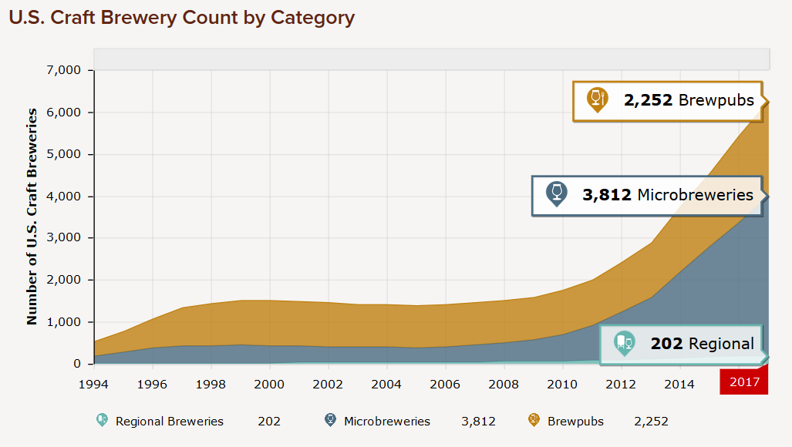

# The Geography of Beer: CS 5890 Final Project
By Jakob Johnson and Derek Hunter

## About Our Project

In 2007, the [Brewer's Association of America](https://www.brewersassociation.org/statistics/number-of-breweries/) consisted of 422 breweries. In 2017, it had grown to nearly 4,000. As the taste of American beer drinkers diversified, simply asking for "a pint of your finest ale, please" was no longer sufficient. Instead, the new craft beer drinkers needed a way to quantify and track which beers they liked and didn't like. A number of beer rating sites sprang up, collecting countless numbers of reviews on hundreds of thousands of beers.

We developed this site as a new way to look at the massive stores of data these beer-ranking sites hold - by location

Breweries distribute beer around their general location, and many drinkers will look for exclsively locally brewed beer. I noticed that none of these beer-ranking sites did a good job showing location information for breweries, nor let a use search by location. When visting a new city, I would have to visit numerous sites and compile a list of reccomended breweries because no one site contained it all. "The Geography of Beer" is our attempt to solve that problem.

By compiling the geographic locations of over 1000 breweries in our [example data set](https://data.world/socialmediadata/beeradvocate) using [Google's geocoding API](https://developers.google.com/maps/documentation/geocoding/start), we were able to build a map to allow users to narrow-down their brewery and beer searches by location as opposed to simply name.

The site then summarizes information similar to other sites, based on filtered or selected breweries or beers. Our goal was to provide the user with a different way of finding their new favorite breweries while keeping the many data attributes that the larger sites have.

Through sorting, we let users explore where the locations of the best (or worst) breweries, with simple map highlighting

We hope you enjoy using our site! Skål!
