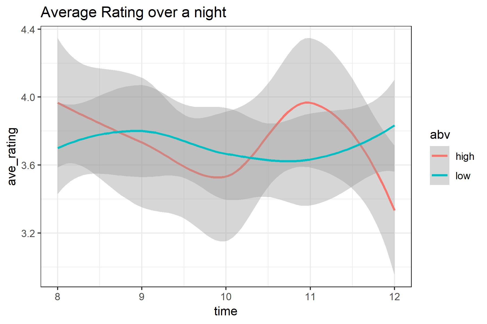

# Basic Info

<!-- The project title, your names, e-mail addresses, UIDs, a link to the project repository. -->

Title: The best beer in the world!

Names: Jakob Johnson ( A01976871, Jakob.Johnson@usu.edu) and Derek Hunter(a01389046, derek.hunter@aggiemail.usu.edu), team `nullpointer`

[Repo Link](https://github.com/jakobottar/cs5890-final-project)

# Background and Motivation

<!-- Discuss your motivations and reasons for choosing this project, especially any background or research interests that may have influenced your decision. -->

In 2007, the Brewer's Association of America consisted of 422 breweries. In 2017, it had grown to nearly 4,000. As the taste of American beer drinkers diversified, simply asking for "a pint of your finest ale, please" was no longer sufficient. Instead, the new craft beer drinkers needed a way to quantify and track which beers they liked and didn't like. A number of beer rating sites sprang up, and BeerAdvocate rose to the top as the most popular.

I (Jakob) chose this dataset because beer is tasty and interests me greatly. Even though a number of beer review sites exist, none of them are particularly good-looking or have good visualizations of the massive databases they collect and store.


This is an example of a beer's page, and though it has a review histogram, very little other information is displayed. [Link.](https://www.beeradvocate.com/beer/profile/22893/73618/)


In the overall brewery page, there are no visualizations, only some basic summary stats and a table of beers (that often has duplicates). [Link.](https://www.beeradvocate.com/beer/profile/22893/)

# Project Objectives

<!-- Provide the primary questions you are trying to answer with your visualization. What would you like to learn and accomplish? List the benefits. -->

In this project, we want to improve upon the BeerAdvocate platform and better visualize the massive amount of data stored in sites like these. We want to better show the "best beers" in regions and styles, and explore how the rating distribution changes between beer styles.

# Data

<!-- From where and how are you collecting your data? If appropriate, provide a link to your data sources. -->

BeerAdvocate has no public API, but a dataset spanning 2001-2011 with more than 1.5 million reviews was [published on data.world](https://data.world/socialmediadata/beeradvocate).
The dataset consists of individual reviews, each with 13 attributes,

- `brewery_id`
- `brewery_name`
- `review_time`
- `review_overall`
- `review_aroma`
- `review_appearance`
- `review_palate`
- `review_taste`
- `review_profilename`
- `beer_style`
- `beer_name`
- `beer_abv`
- `beer_beerid`

We might also look at including data from RateBeer or Untappd, because they seem to be more open to public data use.

For brewery locations, we will automatically get the lat/long coordinates from Google Maps and store them in the data files.

# Data Processing

<!-- Do you expect to do substantial data cleanup? What quantities do you plan to derive from your data? How will data processing be implemented? -->

Processing this massive amount of data will be a challenge. The dataset is fairly large, it had to be split into 4 different `.csv` files, each around 50 Mb to fit into GitHub. Together these take about 5 sec to simply read into a webpage.

We plan on removing data that are too small to be relevant or useful, such as beers with only one or very few reviews, as well as removing attributes that are not useful such as user IDs.

A significant amount of the data will be pre-processed in R, to allow for quicker load and update times.

Another challenge the data will present is that of location. Since we are only provided with a brewery name, we will either have to manually collect data for the largest/best/most relevant breweries or build in some method of retrieving that data from Google Maps or something.

# Visualization Design

<!-- How will you display your data? Provide some general ideas that you have for the visualization design. Develop three alternative prototype designs for your visualization. Create one final design that incorporates the best of your three designs. Describe your designs and justify your choices of visual encodings. We recommend you use the Five Design Sheet Methodology -->

Because of our relatively limited data columns and very large number of rows we're faced with a couple of challenges for our visulization. We're mostly interested in inspecting our data by brewery, for example which breweries, on average, have the best beer. Below is an example table idea we had.

## Visualizing Brewery Information


The basic idea is to do something similar to the world cup assignment, where each row in the table
represents a brewery, and data cells would be some visualization of the average for that brewery.
In the example given above, we used a horizontal boxplot to represent the rating. This could of
course be represented by some kind of start system or even just a number. We feel this
could end up being a little misleading because we're throwing out the distributional information
contained in the dataset. After then the intended behavior would be a user to click on a brewery
of interest and this would add on new rows that would represent each beer that brewery has created.
With similar information to the brewery itself.

This method for visualizing the data has a couple issues though. The main one being that we don't want
to create a table with over 5000 rows. We wouldn't be simplifying the dataset enough.
To solve this problem we would like to be able to grab the lat/long of the breweries in the dataset,
and draw them on a map. From there the user would be able to add a selection to the map which would
filter down the rows in the table to just the breweries selected in the area.

## Visualizing Review Timestamp Information

Another idea we had was to look at the timestamps by user, and see if peoples subjective opinions of
beer change throughout the night as they drink more. Ultimately however we thought this would be
unreasonably difficult to create a visualization for. With the biggest issue being how we aggregate the user data together.
Not to mention any inconsistency in the data that we would need to account for. So we ultimately decided against this idea, but we did
draft a sample visualization of what that may look like.



## Stacked Distribution

In order to show the rating distribution differences between different beer styles, we could use a stacked histogram or distribution plot. The user would be able to select specific beer styles to compare or display a summary of all ratings.

This kind of plot would be relatively lightweight compared to our other ideas as we could pre-process the data and draw the plot with a small summary dataset.


## Proposed Visualization

After reviewing our visualization ideas we decided that trying to build something relating to the timestamp information was really
not feasible. Our proposed visualization incorporates the idea of the stacked distribution and the fitler-able table into the final design.

The core of the design is of a dig-down style. The envisioned use would be to filter a table of all breweries to ones of interest, for instance breweries near me. Then for the user to select the brewery they're interested in which would hide the table, and bring up a 'dashboard' for the brewery. Which has a list of beers grouped by style, as well as a group a distributions histograms for that brewery, for the 5 interesting review metrics(Overall, Aroma, Appearance, and Taste).


# Must-Have Features

<!-- List the features without which you would consider your project to be a failure. -->

A filterable table that summarizes a selection, either of beer style or brewery. We need to be able to look at a subset of the data because trying to plot or build a table of the whole dataset will be prohibitively intensive. So being able to have some kind of filter is necessary.

When a brewery is selected from the table, a "dashboard" of information will be displayed, such as a "top 10" of individual beers, as well as a ratings breakdown by style.

# Optional Features

<!-- List the features which you consider to be nice to have, but not critical. -->

We also need to have some kind of map showing geographic distribution of breweries. This may or may not display every brewery represented in the dataset.

The map will be interactive, allowing brushing to select a subset to display in the table and will contain every brewery.
This will be difficult as getting this data requires pulling from Google Maps or some similar map database.

"falling" and "dropping" animations when styles are selected or deselected from the stacked distribution plot.

# Project Schedule

<!-- Make sure that you plan your work so that you can avoid a big rush right before the final project deadline, and delegate different modules and responsibilities among your team members. Write this in terms of weekly deadlines. -->

- Week 1 (Nov 5-9): Data Pre-processing and Maps Collection, begin table/map implementation.
- Week 2 (Nov 12-16): Rough Table and Map completed, dashboard prototyped with placeholders (Prototype due)
- Week 3 (Nov 19-23): Dashboard implementation, begin design work and cleanup
- Week 4 (Nov 26-30): Final cleanup and animations

# Prototype Work Documentation

The first thing we did was load the dataset into R since it was way too big to view in Excel. Accessing it in R first allowed us to look at all the attributes and quickly determine what exactly we were dealing with. The original dataset was one single `.csv` file that was about 150 Mb in size - too big for GitHub to host - so we split the dataset into 4, 50 Mb files that we could store on GitHub and "bind" together and use as a single dataset for analysis.

After that, we started cleaning up the dataset. The base dataset represented 1586616 different reviews of 56858 beers from 5744 different breweries. A 1.5 million row dataset is too big to reasonably manipulate in JavaScript, let alone load in a timely fashion.
To counter this, since we didn't need to show every review or even every beer at once, we used R to summarize the table by beer, keeping the average ratings for aroma, appearance, palate, taste, and overall score. We also needed to keep track of the beer ID since there may be more than one beer with the same name, as well as count the number of reviews for each beer.
We did the same for breweries, keeping the average rating for each of the 5 attributes, counting the number of beers listed, and storing the beers and beer IDs in a JSON structure to be read later on the site.

This still left us with the original 56,000 beers and 5,700 breweries, some of which have very few reviews or beers. To clean up these micro-microbreweries, we removed any beers that had fewer than 5 reviews, and removed any breweries that had fewer than 5 beers (excluding those with <5 reviews). This brought us down to about 1,600 breweries with 21,000 beers.

We still wanted to be able to access individual reviews for each beer and brewery however, so instead of loading the entire dataset at once, we split the dataset into 1,600 `.csv` files - one for each brewery - to load when the user selects the brewery.

All R code used and process documentation for the project can be seen in `R/ba-explore.md`.

From here what we generated was a little hard to work with in javascript. The structure was a little hard to work with. So we did some further processing.

The frst thing we were missing was the latitude and longitude data for our selected breweries. We solved this by using [Google's geocoding api](https://developers.google.com/maps/documentation/geocoding/start) and we wrote a python script to go through the list of breweries and grab their location data, and generate a `byBrewery-Locations.csv`.

Now that we had the location data it was time for some more data cleaning. We wrote another python script that would use the brewery locations data file, and the 1600 brewery review files from earlier, and generate a `processed_data.json` file.

This file is signifcantly smaller at approximately 10Mb, and we felt was reasonable to load all at once.
This file is just an array of brewery objects that look approximately like the following:

```
{
  "brewery_name": "(512) Brewing Company",
  "brewery_id": "17863",
  "lat": "30.2229723",
  "lng": "-97.7701519",
  "beers": [
    {
      "beer_id": "43535",
      "beer_name": "(512) IPA",
      "beer_abv": "7",
      "beer_style": "American IPA",
      "histogram": {
        "overall": [0, 0, 0, 0, 0],
        "aroma": [0, 0, 0, 0, 0],
        "appearance": [0, 0, 0, 0, 0],
        "palate": [0, 0, 0, 0, 0],
        "taste": [0, 0, 0, 0, 0]
      },
      "n_reviews": 0,
      "averages": {
        "overall": 0,
        "aroma": 0,
        "appearance": 0,
        "palate": 0,
        "taste": 0
      }
    }
  ]
}
```
