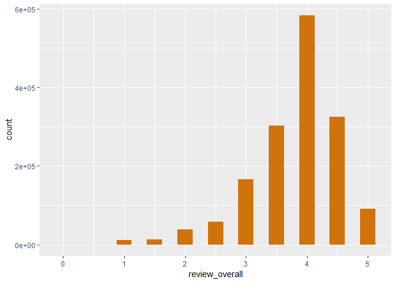
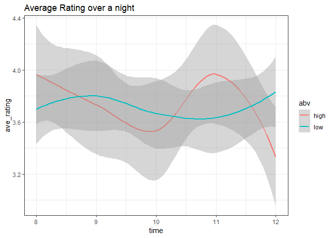
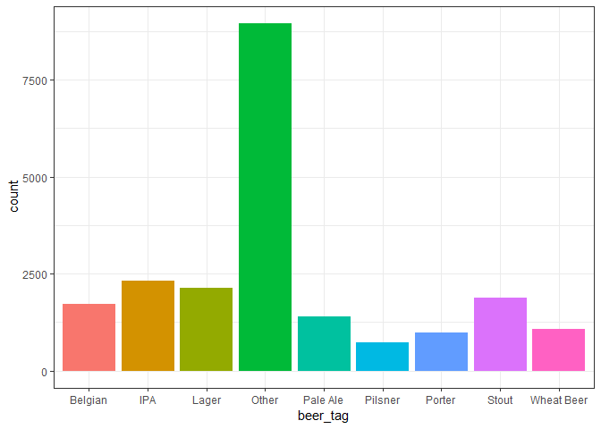

BeerAdvocate Data Exploration and Cleaning
================
Jakob Johnson
11/16/2018

BeerAdvocate Data Exploration and Cleaning
==========================================

For CS 5890 Final Project

Exploration
===========

Import Data
-----------

In this exploration we will be using `ggplot2`, `dplyr`, and `data.table` to read in the data.

``` r
t1 <- fread("data/raw/beer_reviews-1.csv")
t2 <- fread("data/raw/beer_reviews-2.csv")
t3 <- fread("data/raw/beer_reviews-3.csv")
t4 <- fread("data/raw/beer_reviews-4.csv")
  
ba_raw <- rbind(t1, t2, t3, t4) %>% as_tibble() %>% select(-V1)# import the data as a dplyr tibble
rm(t1, t2, t3, t4)
colnames(ba_raw) # the variables:
```

    ##  [1] "brewery_id"         "brewery_name"       "review_time"       
    ##  [4] "review_overall"     "review_aroma"       "review_appearance" 
    ##  [7] "review_profilename" "beer_style"         "review_palate"     
    ## [10] "review_taste"       "beer_name"          "beer_abv"          
    ## [13] "beer_beerid"

Let's get rid of the profile name since it won't be useful.

``` r
ba <- select(ba_raw, -c(review_profilename)) %>% 
  mutate(review_time = review_time)
knitr::kable(head(ba))
```

|  brewery\_id| brewery\_name           |  review\_time|  review\_overall|  review\_aroma|  review\_appearance| beer\_style                    |  review\_palate|  review\_taste| beer\_name             |  beer\_abv|  beer\_beerid|
|------------:|:------------------------|-------------:|----------------:|--------------:|-------------------:|:-------------------------------|---------------:|--------------:|:-----------------------|----------:|-------------:|
|        10325| Vecchio Birraio         |    1234817823|              1.5|            2.0|                 2.5| Hefeweizen                     |             1.5|            1.5| Sausa Weizen           |        5.0|         47986|
|        10325| Vecchio Birraio         |    1235915097|              3.0|            2.5|                 3.0| English Strong Ale             |             3.0|            3.0| Red Moon               |        6.2|         48213|
|        10325| Vecchio Birraio         |    1235916604|              3.0|            2.5|                 3.0| Foreign / Export Stout         |             3.0|            3.0| Black Horse Black Beer |        6.5|         48215|
|        10325| Vecchio Birraio         |    1234725145|              3.0|            3.0|                 3.5| German Pilsener                |             2.5|            3.0| Sausa Pils             |        5.0|         47969|
|         1075| Caldera Brewing Company |    1293735206|              4.0|            4.5|                 4.0| American Double / Imperial IPA |             4.0|            4.5| Cauldron DIPA          |        7.7|         64883|
|         1075| Caldera Brewing Company |    1325524659|              3.0|            3.5|                 3.5| Herbed / Spiced Beer           |             3.0|            3.5| Caldera Ginger Beer    |        4.7|         52159|

These data represent 1586616 different reviews of 56858 beers from 5744 different breweries.

Plots
-----

``` r
p1 <- ggplot(ba) +
  stat_bin(aes(x = review_overall), binwidth = 0.25, fill = "#d1730c")
p1
```



``` r
overTime <- tibble(time = c(8, 9, 10, 11, 12,
                            8, 9, 10, 11, 12,
                            8, 9, 10, 11, 12,
                            8, 9, 10, 11, 12,
                            8, 9, 10, 11, 12,
                            8, 9, 10, 11, 12), 
                   ave_rating = c(3.9, 3.8, 3.6, 4.7, 3.4, 
                                  4.0, 3.7, 3.5, 3.6, 3.3, 
                                  4.0, 3.7, 3.5, 3.6, 3.3,
                                  3.5, 3.6, 3.4, 3.5, 3.5, 
                                  3.8, 3.9, 3.8, 3.7, 4.0, 
                                  3.8, 3.9, 3.8, 3.7, 4.0),
                   person = c(1,1,1,1,1,
                              2,2,2,2,2,
                              3,3,3,3,3,
                              4,4,4,4,4,
                              5,5,5,5,5,
                              6,6,6,6,6),
                   abv = c('high','high','high','high','high',
                           'high','high','high','high','high',
                           'high','high','high','high','high',
                           'low','low','low','low','low',
                           'low','low','low','low','low',
                           'low','low','low','low','low'))

time_plot <- ggplot(overTime, aes(x = time, y = ave_rating, color = abv)) + 
  geom_smooth() + labs(title = "Average Rating over a night") + theme_bw()
time_plot
```

    ## `geom_smooth()` using method = 'loess' and formula 'y ~ x'



``` r
ggsave("process_img/time_vis.jpg", time_plot, width = 6, height = 4, units = 'in')
```

    ## `geom_smooth()` using method = 'loess' and formula 'y ~ x'

<br>

Data Cleaning and Grouping
==========================

By Beer Grouping
----------------

``` r
by_beer <- ba %>%
  group_by(beer_name) %>%
  summarize(beer_id = beer_beerid[1],
            brewery_name = brewery_name[1],
            brewery_id = brewery_id[1],
            beer_style = beer_style[1],
            beer_abv = beer_abv[1],
            mean_overall = mean(review_overall),
            mean_aroma = mean(review_aroma),
            mean_appearance = mean(review_appearance),
            mean_palate = mean(review_palate),
            mean_taste = mean(review_taste),
            n_reviews = length(beer_name))%>%
  filter(n_reviews >= 5)

included_beers <- by_beer$beer_name

ba <- ba %>% filter(beer_name %in% included_beers)

knitr::kable(filter(by_beer, brewery_name == "Uinta Brewing Company") %>% head(.,5))
```

| beer\_name              |  beer\_id| brewery\_name         |  brewery\_id| beer\_style             |  beer\_abv|  mean\_overall|  mean\_aroma|  mean\_appearance|  mean\_palate|  mean\_taste|  n\_reviews|
|:------------------------|---------:|:----------------------|------------:|:------------------------|----------:|--------------:|------------:|-----------------:|-------------:|------------:|-----------:|
| Angler's Pale Ale       |     10573| Uinta Brewing Company |         1416| American Pale Ale (APA) |        5.8|       3.748000|     3.532000|          3.740000|      3.492000|     3.576000|         125|
| Anniversary Barley Wine |      3840| Uinta Brewing Company |         1416| American Barleywine     |       10.4|       3.769366|     3.892606|          3.924296|      3.779930|     3.818662|         284|
| Baba Black Lager        |     73965| Uinta Brewing Company |         1416| Euro Dark Lager         |        4.0|       3.566667|     3.500000|          3.900000|      3.733333|     3.500000|          15|
| Blue Sky Pilsner        |     20281| Uinta Brewing Company |         1416| Czech Pilsener          |        4.0|       3.596154|     3.384615|          3.557692|      3.423077|     3.326923|          26|
| Bristlecone Brown       |     14190| Uinta Brewing Company |         1416| English Brown Ale       |        4.0|       3.576923|     3.307692|          3.807692|      3.384615|     3.346154|          13|

``` r
pickTag <- function(x){
  check = c("IPA", "Belgian", "Dubbel", "Tripel", "Quad", "wit",  "Stout", "Porter", "Pale Ale", "Lager", "Keller", "Pilsner", "Pilsener", "weizen", "Wheat", "Weiss")
  to =    c("IPA", "Belgian", "Belgian", "Belgian", "Belgian", "Belgian","Stout", "Porter", "Pale Ale", "Lager", "Lager", "Pilsner", "Pilsner", "Wheat Beer", "Wheat Beer", "Wheat Beer")
  
  # tag_maps <- tibble(check = check, to = to)
  
  for(i in 1:length(check)){
      if(grepl(check[i], x)){
        return(to[i])
      }
  }
  return("Other")
}

makeTags <- function(style){
  
  tags <- character(length(style))
    
  for(i in 1:length(style)){
    tags[i] = pickTag(style[i])
  }
  
  return(tags)
}

by_beer <- mutate(by_beer, beer_tag = makeTags(beer_style))

# write.csv(by_beer, "data/byBeer.csv")

ggplot(by_beer) +
  stat_count(aes(x = beer_tag, fill = beer_tag)) +
  theme_bw() +
  theme(legend.position = "none") 
```



``` r
other_styles <- filter(by_beer, beer_tag == "Other")$beer_style %>% unique()
other_styles
```

    ##  [1] "American Barleywine"                
    ##  [2] "Fruit / Vegetable Beer"             
    ##  [3] "Pumpkin Ale"                        
    ##  [4] "English Bitter"                     
    ##  [5] "Altbier"                            
    ##  [6] "American Black Ale"                 
    ##  [7] "American Brown Ale"                 
    ##  [8] "Witbier"                            
    ##  [9] "American Amber / Red Ale"           
    ## [10] "Black & Tan"                        
    ## [11] "Scottish Gruit / Ancient Herbed Ale"
    ## [12] "Saison / Farmhouse Ale"             
    ## [13] "Flanders Oud Bruin"                 
    ## [14] "Weizenbock"                         
    ## [15] "American Wild Ale"                  
    ## [16] "English Barleywine"                 
    ## [17] "Old Ale"                            
    ## [18] "Smoked Beer"                        
    ## [19] "Winter Warmer"                      
    ## [20] "American Blonde Ale"                
    ## [21] "Extra Special / Strong Bitter (ESB)"
    ## [22] "English Strong Ale"                 
    ## [23] "American Strong Ale"                
    ## [24] "American Malt Liquor"               
    ## [25] "Doppelbock"                         
    ## [26] "Bock"                               
    ## [27] "Schwarzbier"                        
    ## [28] "Kölsch"                            
    ## [29] "Herbed / Spiced Beer"               
    ## [30] "Flanders Red Ale"                   
    ## [31] "Scotch Ale / Wee Heavy"             
    ## [32] "Bière de Garde"                    
    ## [33] "Rauchbier"                          
    ## [34] "Roggenbier"                         
    ## [35] "Maibock / Helles Bock"              
    ## [36] "Scottish Ale"                       
    ## [37] "California Common / Steam Beer"     
    ## [38] "Chile Beer"                         
    ## [39] "Rye Beer"                           
    ## [40] "Märzen / Oktoberfest"              
    ## [41] "English Dark Mild Ale"              
    ## [42] "English Brown Ale"                  
    ## [43] "Irish Red Ale"                      
    ## [44] "Cream Ale"                          
    ## [45] "Braggot"                            
    ## [46] "English Pale Mild Ale"              
    ## [47] "Lambic - Fruit"                     
    ## [48] "Sahti"                              
    ## [49] "Gueuze"                             
    ## [50] "Happoshu"                           
    ## [51] "Eisbock"                            
    ## [52] "Low Alcohol Beer"                   
    ## [53] "Lambic - Unblended"                 
    ## [54] "Faro"                               
    ## [55] "Gose"                               
    ## [56] "Bière de Champagne / Bière Brut"  
    ## [57] "Kvass"

After grouping reviews of the same beer, and removing beers with &lt;5 reviews, we are now down to 21184 observations and 13 variables.

By Brewery Grouping
-------------------

``` r
by_brewery <- ba %>%
  group_by(brewery_name) %>%
  summarize(brewery_id = brewery_id[1],
            beers = jsonlite::toJSON(unique(beer_name)), 
            beers_id = jsonlite::toJSON(as.character(unique(beer_beerid))), 
            n_beers = length(unique(beer_name)),
            mean_overall = mean(review_overall),
            mean_aroma = mean(review_aroma),
            mean_appearance = mean(review_appearance),
            mean_palate = mean(review_palate),
            mean_taste = mean(review_taste),
            n_reviews = length(brewery_name)) %>%
  filter(n_beers >= 5)

write.csv(by_brewery, "data/byBrewery-noLocations.csv", row.names = FALSE)

included_breweries <- by_brewery$brewery_id

ba <- ba %>% filter(brewery_id %in% included_breweries)

knitr::kable(sample_n(by_brewery, 5))
```

| brewery\_name                     |  brewery\_id| beers                                                                                                                                                                                                                                                                                                                                                                                                                                                                                                                                                                                  | beers\_id                                                                                                                                                                                                    |  n\_beers|  mean\_overall|  mean\_aroma|  mean\_appearance|  mean\_palate|  mean\_taste|  n\_reviews|
|:----------------------------------|------------:|:---------------------------------------------------------------------------------------------------------------------------------------------------------------------------------------------------------------------------------------------------------------------------------------------------------------------------------------------------------------------------------------------------------------------------------------------------------------------------------------------------------------------------------------------------------------------------------------|:-------------------------------------------------------------------------------------------------------------------------------------------------------------------------------------------------------------|---------:|--------------:|------------:|-----------------:|-------------:|------------:|-----------:|
| Weeping Radish Eco Farm & Brewery |        16060| \["Corolla Gold Helles Lager","Kölsch","Black Radish Dark Lager","Weizen","Farm Brew Altbier","Dunkleweizen","Fest Amber Lager","Radler","Maibock","Oktoberfest","Doppelbock","Pumpkin Bock","OBX Beer"\]                                                                                                                                                                                                                                                                                                                                                                             | \["38780","38783","38885","38846","38976","49590","38883","44195","37574","38847","43847","45366","58979"\]                                                                                                  |        13|       3.251572|     3.163522|          3.537736|      3.317610|     3.154088|         159|
| Shamrock Brewing Co.              |        14484| \["Hefeweizen","Irish Porter","Irish Red Ale","Instigator Doppelbock","Saison"\]                                                                                                                                                                                                                                                                                                                                                                                                                                                                                                       | \["71183","41519","57921","69373","40066"\]                                                                                                                                                                  |         5|       3.687500|     3.687500|          3.500000|      3.687500|     3.625000|           8|
| Hinterland Brewery Restaurant     |         4426| \["Oktoberfest","Bourbon Barrel Scotch Ale","Door County Cherry Wheat","Luna Coffee Stout","Weizen Bier","Amber Ale","India Pale Ale","Pale Ale","Maple Bock","Winterland","Honey Wheat","Scottish Ale","Bourbon Stout","Pub Draught"\]                                                                                                                                                                                                                                                                                                                                                | \["61955","72284","60060","32763","41713","10180","71545","10175","10182","63379","10183","39751","35895","10185"\]                                                                                          |        14|       3.808696|     3.730435|          3.932609|      3.739130|     3.741304|         230|
| Brouwerij Martens NV              |         3517| \["Berthold Keller Premium Lager","Martens Pilsener","Martens Low Carbohydrate","Larine Grand 95","Belgian White"\]                                                                                                                                                                                                                                                                                                                                                                                                                                                                    | \["53551","20134","14646","46110","15290"\]                                                                                                                                                                  |         5|       2.787037|     2.800926|          3.157407|      2.745370|     2.657407|         108|
| Big Sky Brewing Company           |          751| \["Moose Drool Brown Ale","Big Sky IPA","Montana Trout Slayer Ale","Scape Goat Pale Ale","Slow Elk Oatmeal Stout","Double IPA","Olde Bluehair - Barrel Aged","Belgian Brown Ale","Bottleworks XI Anniversary Ale","All Souls Ale","406 Saison","Extra Pale Ale","Powder Hound Winter Ale","Heavy Horse Scotch Ale","Mexican Lager","Cherry Bomb Stout","Crystal Ale","Summer Honey Ale","Belgian Pale Ale","Buckin' Monk Tripel Ale","Smoove Cherry Ale","Biere De Noel","Bobo's Robust Porter","Big Sky Old Blue Hair Bourbon Aged 2006","Ivan The Terrible","Cowboy Coffee Porter"\] | \["2296","5554","38636","2973","2284","61261","47476","64994","56416","65165","61535","36955","2263","61771","52120","5553","17699","4367","32649","52634","40958","36954","32648","41636","45849","57466"\] |        26|       3.807100|     3.683133|          3.826634|      3.661908|     3.721826|        2662|

Remove beers from breweries we removed

``` r
by_beer <- by_beer %>% filter(brewery_id %in% included_breweries)

write.csv(by_beer, "data/byBeer.csv", row.names = FALSE)
```

After grouping reviews from beers at the same brewery, and removing breweries with &lt;5 beers, we are now down to 1638 observations and 11 variables.

CSV Split
---------

In this we will split the original `ba` dataset by brewery and write each to a csv. This will allow for easier and faster loading on the webpage.

``` r
ba %>% group_by(brewery_name) %>%
  do(write.csv(., sprintf("data/breweries/%s.csv", .$brewery_id[1]), row.names = FALSE))
```
